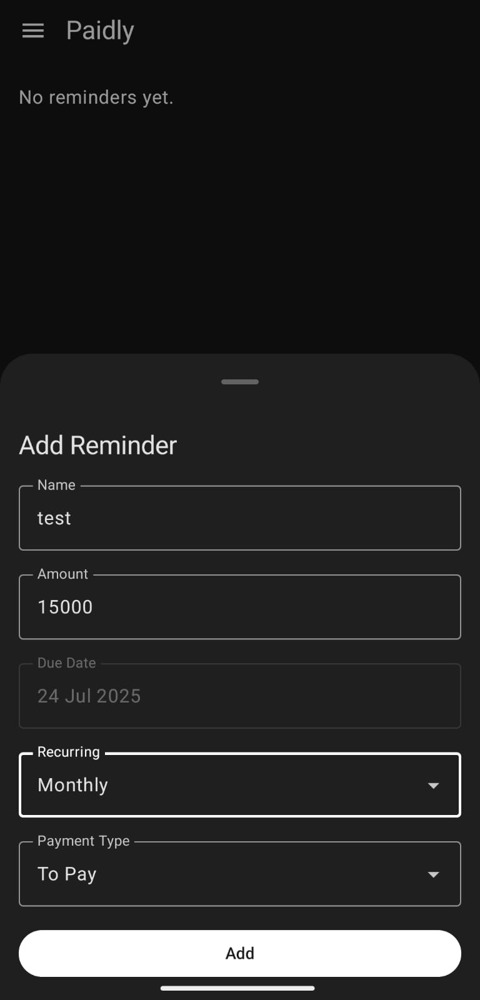
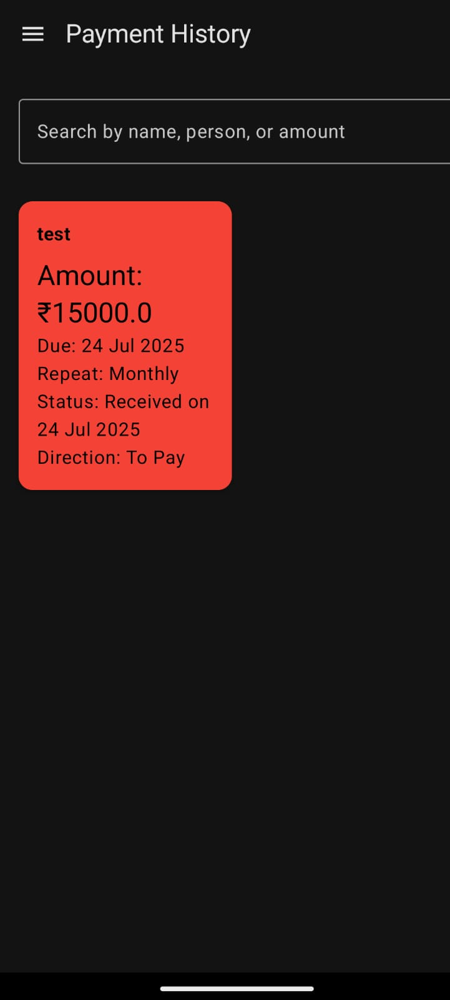
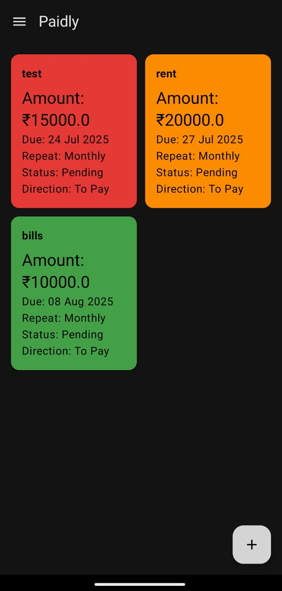
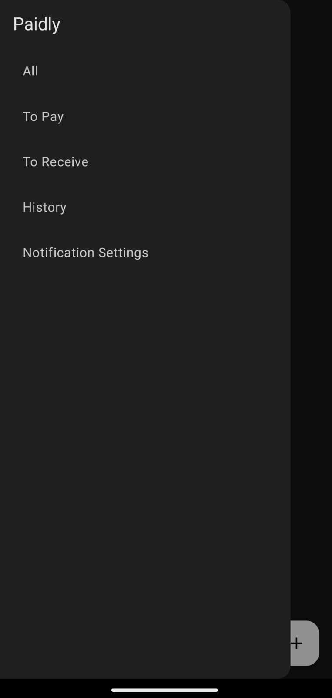
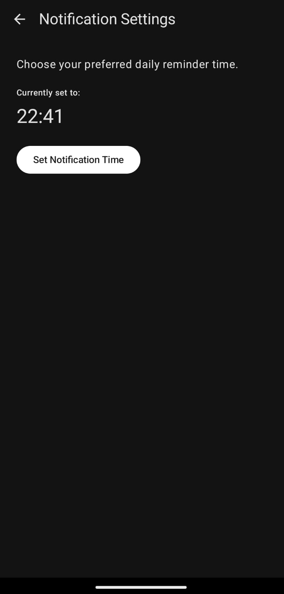

# Paidly — Smart Payment Reminder App

Paidly is a modern Android application developed using Jetpack Compose, designed to help users manage, track, and receive reminders for payments—whether they are dues to be paid or collected. With a color-coded UI, recurring reminder support, and notification alerts, Paidly simplifies personal finance tracking in an efficient and intuitive way.

---

## Features

### 1. Add, Edit, and Delete Reminders
- Create reminders with essential details: name, amount, due date, and type (To Pay / To Receive)
- Modify or delete reminders at any time
- Undo support via snackbar for accidental actions

### 2. Recurring Reminders
- Supports recurring intervals: None, Daily, Weekly, and Monthly
- Automatically generates the next instance of a reminder upon marking it as "Received"

### 3. Color-Coded Grid UI
- Red cards: Payments due within 3 days  
- Orange cards: Payments due within 2 weeks  
- Green cards: Payments due beyond 2 weeks  
- Uses a responsive `LazyVerticalGrid` layout for better organization

### 4. Navigation Drawer with Filtered Views
- Toggle between different reminder types:
  - All Reminders
  - To Pay
  - To Receive
  - History (Completed)
  - Notification Settings

### 5. History Page
- View all completed reminders that have been marked as "Received"
- Data is stored and managed using Room for persistence

### 6. Detailed Reminder View
- Tap on any reminder card to view a detailed bottom sheet
- Includes full information, an editable notes field, and options to mark as received or delete

### 7. Daily Notification Reminders
- Users can configure a preferred daily time for receiving reminders
- Notifications are delivered once daily, even if the app is not running
- Handled using WorkManager and NotificationChannel APIs

### 8. Boot Persistence
- Reminders are automatically re-scheduled after device reboot using a Boot BroadcastReceiver

---


## 📸 App Screenshots

<p align="center">
  
  
  
  
  
</p>
---


## Tech Stack

| Component         | Technology                         |
|-------------------|-------------------------------------|
| UI                | Jetpack Compose, Material3          |
| Architecture      | MVVM                                |
| Navigation        | Jetpack Navigation Compose          |
| Database          | Room (SQLite ORM)                   |
| Background Tasks  | WorkManager with CoroutineWorker    |
| Preferences       | SharedPreferences                   |
| Notifications     | NotificationCompat, NotificationChannel |
| Language          | Kotlin                              |
| Min SDK           | 26 (Android 8.0)                    |

---

## Debugging and Testing

- Logs are filtered using the `PaidlyNotif` tag for easier debugging
- Logging includes:
  - WorkManager execution status
  - Time match checks
  - Reminder fetch counts
- Manual invocation of `scheduleDailyReminder()` is supported for testing
- App behavior has been validated for:
  - Background and killed states
  - Device restarts
  - Avoiding duplicate daily notifications

---

## Folder Structure

com.example.paidly
│
├── data.local                 # Room database setup
│   ├── PaymentReminderDao.kt
│   ├── PaymentReminderEntity.kt
│   └── PaidlyDatabase.kt
│
├── ui.screens                 # Jetpack Compose UI screens
│   ├── HomeScreen.kt
│   ├── HistoryScreen.kt
│   ├── NotificationSettingsScreen.kt
│   └── ReminderDetailsBottomSheet.kt
│
├── utils                      # Utility classes and workers
│   ├── NotificationWorker.kt
│   ├── NotificationUtils.kt
│   ├── NotificationPreferenceManager.kt
│   ├── BootReceiver.kt
│   └── scheduleDailyReminder.kt
│
├── navigation
│   └── AppNavigation.kt
│
└── MainActivity.kt
---

## Permissions Used

```xml
<uses-permission android:name="android.permission.POST_NOTIFICATIONS" />
<uses-permission android:name="android.permission.RECEIVE_BOOT_COMPLETED" />
```

---

## Future Enhancements

- Google Calendar integration
- Reminder snooze functionality
- Cloud sync support (e.g., Firebase, Supabase)
- Export data as Excel or CSV
- Biometric authentication for security

---

## License
 
This project welcomes collaboration and feedback. Feel free to fork the repository or open issues and pull requests.
